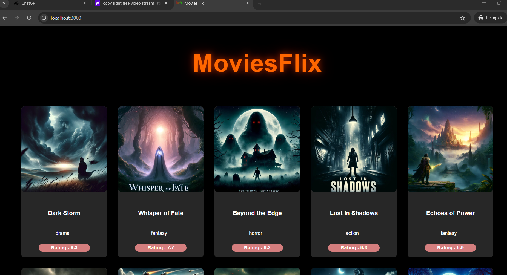
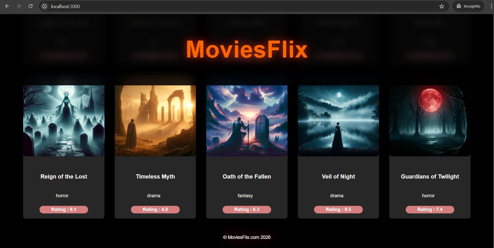
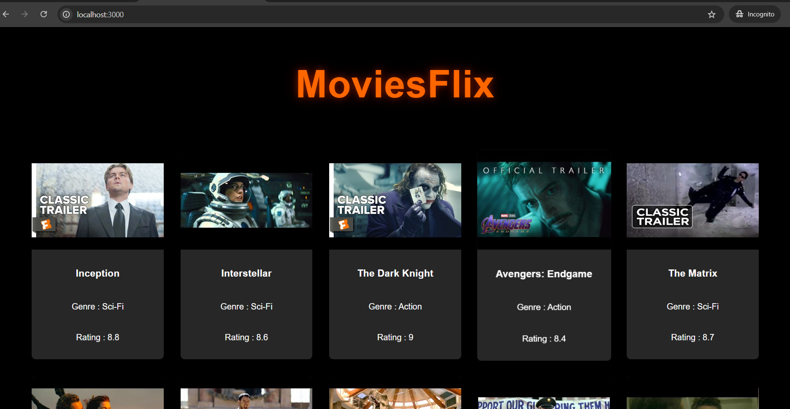
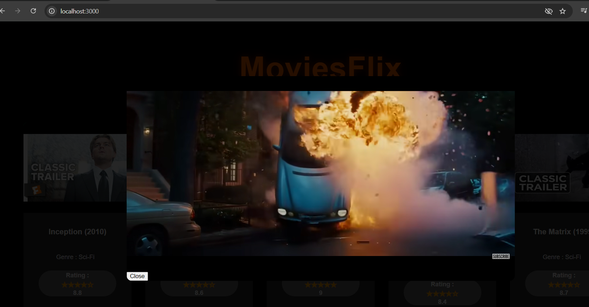

# 🎬 MovieFlix – React Beginner Application

MovieFlix is a beginner-level React application created to understand core React concepts such as
component-based architecture, hooks, state management, and UI rendering.

This project was built as a hands-on exercise while learning React fundamentals.

---

## 🚀 Features

- Display list of movies
- Search movies
- Movie details view
- Responsive UI
- Component-based structure
- Conditional rendering and state updates

---

## 🛠️ Tech Stack

- React.js (Create React App)
- JavaScript (ES6)
- HTML5
- CSS3

### `npm start`

Runs the app in the development mode.\
Open [http://localhost:3000](http://localhost:3000) to view it in your browser.

The page will reload when you make changes.\
You may also see any lint errors in the console.

### `npm test`

Launches the test runner in the interactive watch mode.\
See the section about [running tests](https://facebook.github.io/create-react-app/docs/running-tests) for more information.

### `npm run build`

Builds the app for production to the `build` folder.\
It correctly bundles React in production mode and optimizes the build for the best performance.

The build is minified and the filenames include the hashes.\
Your app is ready to be deployed!

### `npm run build` fails to minify

